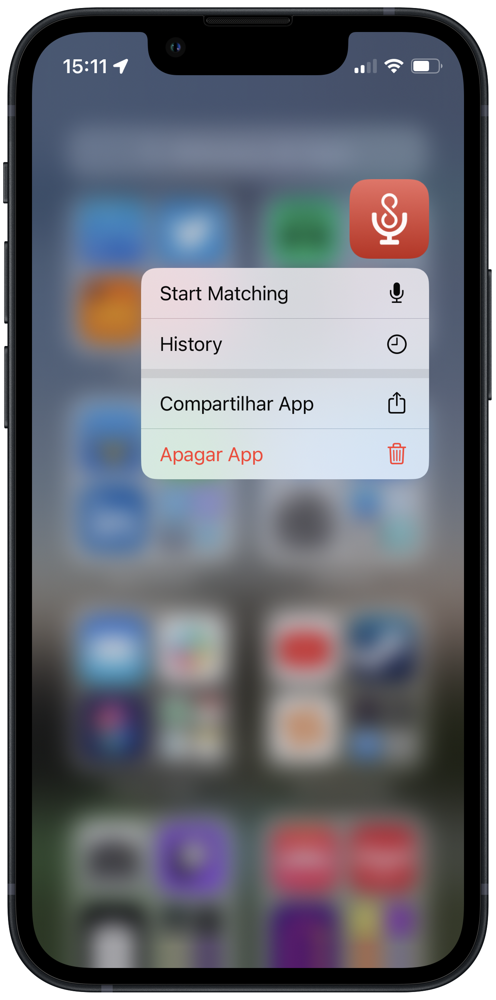

### `Version 1.1`
# AirScrobble 1.1: Like new songs and start matching faster

AirScrobble first update is now live, bringing a couple of new features that will help you start matching new discoveries faster and 

## Add new discoveries to Liked Tracks on Last.fm

Heard a new song that instantly became your latest obsession? Now you can add any new matches to your Liked Track list on your Last.fm profile! Simply tap the 􀍡 button and select the new `Love Track on Last.fm` option to add it to your faves. You can also double tap on the song's artwork to like it!

## Start matching or check your history with Quick Actions

Need to discover what's playing around ASAP? Or want to remember what was that song that you got hooked on earlier in the day? With the newly added Quick Actions you can press and hold the app's icon to access new shortcuts to access a feature as soon as the app opens! For this inital release, we are launching Quick Actions to start matching when opening the app and to access your history.

And for the powerusers out there, we are also exposing these shortcuts through a new URL scheme that's been added with version 1.1! AirScrobble will use the `airscrobble://` format and you can launch these quick actions with the following URLs:

- `airscrobble://match` to start matching upon opening the app
- `airscrobble://history` to open the history page in the app

---

I hope you've been enjoying AirScrobble and hopefully this update will make you love it even more! If you're feeling generous, consider [leaving a review in the App Store](https://itunes.apple.com/app/id1618366994?action=write-review)!

As iOS 16 approaches, we'll surely have some sweet new features for you early adopters out there. [Stay tuned on our Twitter page](https://twitter.com/AirScrobble) to get some exclusive sneakpeeks 👀

### `Initial Release`
# AirScrobble is now available in the App Store

I'm glad to announce that AirScrobble is finally available in the App Store! After months of working on my spare time, it's great to finally put out this tool that has been quite helpful for me and I hope you find it useful as well!

I've shared the story behind the app on Product Hunt if you want to learn more about how this app came to be. Make sure you give it a look and show some support:

[You can download AirScrobble here](https://apps.apple.com/us/app/airscrobble/id1618366994). Please let me know your thoguhts on [@AirScrobble](https://twitter.com/airscroble)!

### `Pre-order`
# Now available for pre-order

[AirScrobble is now open for pre-order at the App Store!](https://apps.apple.com/us/app/airscrobble/id1618366994) Make sure you pre-save the app so you can get your hands on as soon as it releases this Sunday, August 21st!

Make sure you stay tuned on [Twitter](twitter.com/airscrobble) or check out our [roadmap page](https://changemap.co/tomas-martins/airscrobble) to stay up to date on what we have planned going forward!

### `Beta`
# **Version 1.0 (TestFlight build)**
AirScrobble is currently under beta on TestFlight. On this inital release I am aiming to release the core feature of this app, which is beign able to identify a song playing around and to scrobble it on a Last.fm profile quickly. If you're interested in joining the TestFlight, feel free to [send us a message on our Twitter profile](twitter.com/airscrobble)!
